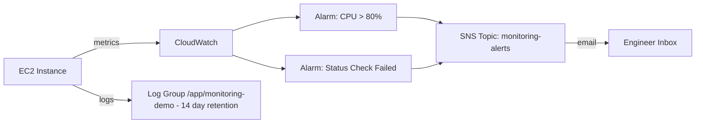

# Architecture — CloudWatch & SNS Monitoring

Cloud monitoring and alerting: CloudWatch alarms watch EC2 metrics and notify via SNS email; application logs are retained in a log group.

## How it works

- CloudWatch collects EC2 metrics such as CPU utilization and status checks.
- Alarms trigger when CPU exceeds 80% or an instance status check fails.
- Alarms publish to an SNS topic which emails the on-call engineer.
- Application logs are stored in a CloudWatch Log Group with a 14-day retention policy.
